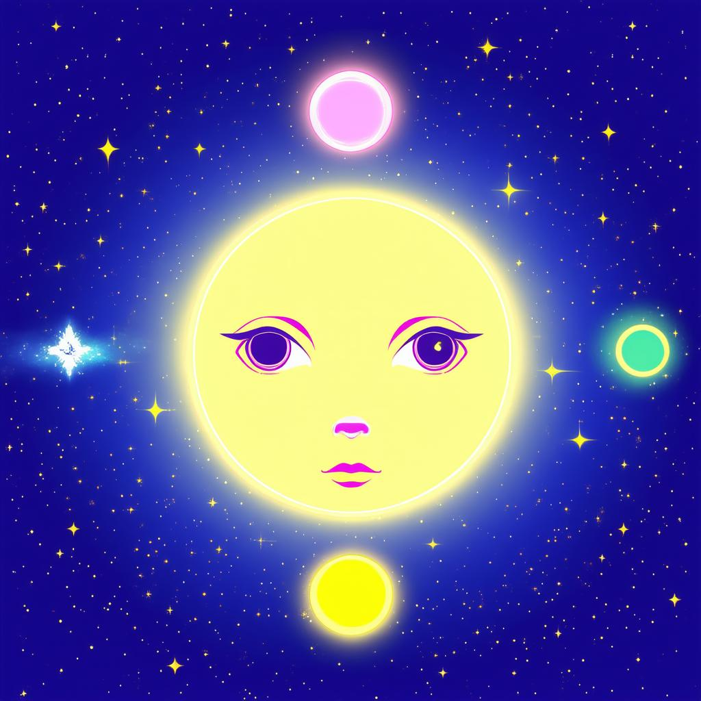

# VisoLearn - AI-Powered Image Description Game


<div style="width: 100%; text-align: center;">
    
</div>

[](https://opensource.org/licenses/MIT)
[](https://www.typescriptlang.org/)
[](https://reactjs.org/)
[](https://remix.run)
[](https://tailwindcss.com/)
[](https://cloud.google.com/)
[](https://nodejs.org/)
## 📖 Table of Contents
1. [Overview](#overview)
2. [Core Features](#core-features)
3. [Technical Architecture](#technical-architecture)
4. [Game Mechanics](#game-mechanics)
5. [Implementation Details](#implementation-details)
6. [Setup Guide](#setup-guide)
7. [Development Guide](#development-guide)
8. [API Integration](#api-integration)
9. [User Interface](#user-interface)
10. [Performance Optimizations](#performance-optimizations)
11. [Troubleshooting](#troubleshooting)
12. [Contributing](#contributing)
13. [Advanced Configuration](#advanced-configuration)

## 🌟 Overview

VisoLearn is a sophisticated web application that combines cutting-edge AI technology with gamification to create an engaging image description learning experience. The application leverages Google's Gemini AI to generate unique images and provide intelligent feedback, making it an ideal tool for language learning, observation skills development, and educational purposes.

## 💫 Core Features

### Image Generation System
- **Dynamic Image Creation**
  - Real-time image generation based on user parameters
  - Content-aware feature generation
  - Safety-filtered output ensuring appropriate content
  - Customizable style and complexity levels

### Interactive Game System
- **Adaptive Difficulty**
  - Three difficulty levels: Easy, Medium, Hard
  - Dynamic feature complexity adjustment
  - Progressive hint system
  - Customizable winning conditions

### AI Chat Interface
- **Intelligent Feedback**
  - Context-aware responses
  - Progressive hint system
  - Natural language processing
  - Adaptive learning patterns

### Progress Tracking
- **Real-time Statistics**
  - Feature discovery tracking
  - Attempt counting
  - Success rate calculation
  - Session persistence

## 🏗 Technical Architecture

### Frontend Architecture
```typescript
// Core Component Structure
root/
├── components/
│   ├── GameBoard/
│   ├── ChatInterface/
│   └── ProgressTracker/
├── routes/
│   ├── _index.tsx        // Main game interface
│   └── api/
│       └── chat.ts       // Chat endpoint
└── utils/
    └── gemini.server.ts  // AI integration
```

### State Management
```typescript
// Core Game State Interface
interface GameState {
  image: ImageData | null;
  chatHistory: DisplayChatEntry[];
  correctFeatures: string[];
  gameTrulyFinished: boolean;
  thresholdMet: boolean;
  allFeaturesFound: boolean;
  gameStarted: boolean;
  attemptsRemaining: number;
  maxAttempts: number;
  winThreshold: number;
  userInput: UserInputConfig | null;
  animatingFeatures: string[];
}
```

## 🎮 Game Mechanics

### Feature Discovery System
1. **Input Processing**
   ```typescript
   const processUserInput = (input: string): FeatureMatch[] => {
     return features.filter(feature =>
       matchFeature(input.toLowerCase(), feature.toLowerCase())
     );
   };
   ```

2. **Scoring Algorithm**
   ```typescript
   const calculateScore = (
     foundFeatures: string[],
     totalFeatures: string[],
     threshold: number
   ): GameScore => {
     const score = foundFeatures.length;
     const thresholdMet = score >= threshold;
     const complete = score === totalFeatures.length;
     return { score, thresholdMet, complete };
   };
   ```

### Hint Generation System
- Contextual awareness of previous attempts
- Progressive specificity based on attempts remaining
- Location-based hints for spatial features
- Category-based hints for conceptual features

## 🔧 Implementation Details

### Gemini AI Integration
```typescript
// Sample AI Configuration
const generationConfig = {
  temperature: 0.8,
  topP: 1,
  topK: 32,
  maxOutputTokens: 256,
};

const safetySettings = [
  {
    category: HarmCategory.HARM_CATEGORY_HARASSMENT,
    threshold: HarmBlockThreshold.BLOCK_MEDIUM_AND_ABOVE,
  },
  // Additional safety configurations...
];
```

### State Persistence
```typescript
// Local Storage Management
const persistGameState = (state: GameState) => {
  localStorage.setItem(STORAGE_KEY_GAME_STATE, JSON.stringify(state));
};

const restoreGameState = (): GameState | null => {
  const saved = localStorage.getItem(STORAGE_KEY_GAME_STATE);
  return saved ? JSON.parse(saved) : null;
};
```

## 🚀 Setup Guide

### Environment Configuration
```bash
# Required Environment Variables
GEMINI_API_KEY=your_api_key_here
NODE_ENV=development|production
PORT=3000
```

### Installation Steps
```bash
# Install dependencies
npm install

# Setup development environment
npm run setup

# Configure environment variables
cp .env.example .env
```

## 💻 Development Guide

### Local Development
```bash
# Start development server
npm run dev

# Run type checking
npm run typecheck

# Run linting
npm run lint
```

### Build Process
```bash
# Create production build
npm run build

# Start production server
npm start
```

## 🔌 API Integration

### Gemini AI Endpoints
```typescript
// Image Generation
export async function generateImage(prompt: string): Promise<ImageData | null>;

// Feature Extraction
export async function generateImageFeatures(
  imageDescription: string
): Promise<string[]>;

// Hint Generation
export async function getGeminiHint(
  targetFeatures: string[],
  userAttempt: string,
  chatHistory: ChatEntry[]
): Promise<string>;
```

## 🎨 User Interface

### Responsive Design
- Mobile-first approach
- Breakpoint system:
  ```css
  /* Breakpoint examples */
  sm: '640px'
  md: '768px'
  lg: '1024px'
  xl: '1280px'
  2xl: '1536px'
  ```

### Theme System
```css
/* Dark mode support */
@media (prefers-color-scheme: dark) {
  :root {
    --bg-primary: theme('colors.gray.900');
    --text-primary: theme('colors.gray.100');
  }
}
```

## ⚡ Performance Optimizations

### Image Loading
- Lazy loading for images
- Progressive image loading
- Optimal image sizing
- Cache management

### State Updates
- Debounced user input
- Optimistic UI updates
- Efficient re-rendering strategies
- Memoized computations

## 🔍 Troubleshooting

### Common Issues
1. **API Connection Issues**
   - Check API key configuration
   - Verify network connectivity
   - Review rate limiting

2. **State Persistence Problems**
   - Clear localStorage
   - Reset game state
   - Check browser compatibility

## 🤝 Contributing

### Development Process
1. Fork the repository
2. Create feature branch
3. Implement changes
4. Write tests
5. Submit pull request

### Code Style
- Follow TypeScript best practices
- Use Prettier for formatting
- Follow ESLint rules
- Write documentation

## ⚙️ Advanced Configuration

### Custom Game Rules
```typescript
interface GameConfig {
  maxAttempts: number;
  winThreshold: number;
  difficulty: 'easy' | 'medium' | 'hard';
  features: number;
  timeLimit?: number;
}
```

### AI Parameters
```typescript
interface AIConfig {
  temperature: number;
  topP: number;
  topK: number;
  maxTokens: number;
  safetyLevel: SafetyLevel;
}
```

## 📝 License

This project is licensed under the MIT License. See the [LICENSE](LICENSE) file for details.

## 🙏 Acknowledgments

- Google AI Team
- Remix Framework Team
- Tailwind CSS Team
- Open Source Contributors

## 📚 Additional Resources

- [API Documentation](docs/api.md)
- [Contributing Guide](CONTRIBUTING.md)
- [Code of Conduct](CODE_OF_CONDUCT.md)
- [Change Log](CHANGELOG.md)
