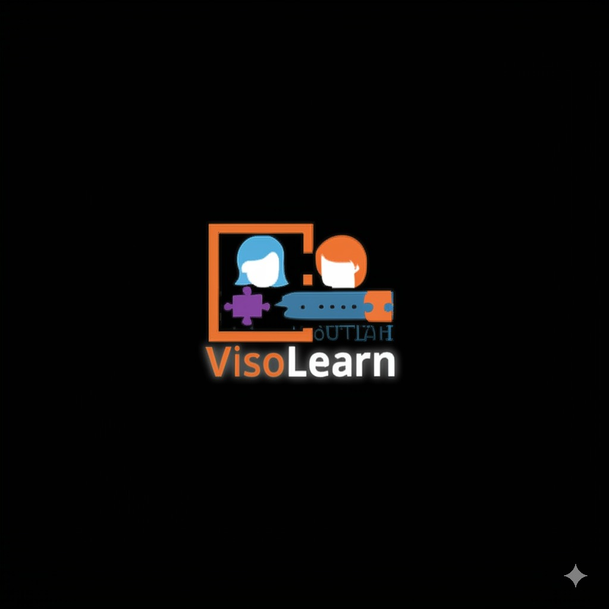

# VisoLearn - AI-Powered Image Description Game


<div style="width: 100%; text-align: center;">
    
</div>


[](https://opensource.org/licenses/MIT)
[](https://www.typescriptlang.org/)
[](https://reactjs.org/)
[](https://remix.run)
[](https://tailwindcss.com/)
[](https://cloud.google.com/)
[](https://nodejs.org/)
## 📖 Table of Contents
1. [Overview](#overview)
2. [Core Features](#core-features)
3. [Technical Architecture](#technical-architecture)
4. [Game Mechanics](#game-mechanics)
5. [Implementation Details](#implementation-details)
6. [Setup Guide](#setup-guide)
7. [Development Guide](#development-guide)
8. [API Integration](#api-integration)
9. [User Interface](#user-interface)
10. [Performance Optimizations](#performance-optimizations)
11. [Troubleshooting](#troubleshooting)
12. [Contributing](#contributing)
13. [Advanced Configuration](#advanced-configuration)
14. [Data Architecture](#data-architecture)
15. [Data Flow](#data-flow)
16. [Flow Charts](#flow-charts)

## 🌟 Overview

VisoLearn is a sophisticated web application that combines cutting-edge AI technology with gamification to create an engaging image description learning experience. The application leverages Google's Gemini AI to generate unique images and provide intelligent feedback, making it an ideal tool for language learning, observation skills development, and educational purposes.

## 💫 Core Features

### Image Generation System
- **Dynamic Image Creation**
  - Real-time image generation based on user parameters
  - Content-aware feature generation
  - Safety-filtered output ensuring appropriate content
  - Customizable style and complexity levels

### Interactive Game System
- **Adaptive Difficulty**
  - Three difficulty levels: Easy, Medium, Hard
  - Dynamic feature complexity adjustment
  - Progressive hint system
  - Customizable winning conditions

### AI Chat Interface
- **Intelligent Feedback**
  - Context-aware responses
  - Progressive hint system
  - Natural language processing
  - Adaptive learning patterns

### Progress Tracking
- **Real-time Statistics**
  - Feature discovery tracking
  - Attempt counting
  - Success rate calculation
  - Session persistence

## 🏗 Technical Architecture

### Frontend Architecture
```typescript
// Core Component Structure
root/
├── components/
│   ├── GameBoard/
│   ├── ChatInterface/
│   └── ProgressTracker/
├── routes/
│   ├── _index.tsx        // Main game interface
│   └── api/
│       └── chat.ts       // Chat endpoint
└── utils/
    └── gemini.server.ts  // AI integration
```

### State Management
```typescript
// Core Game State Interface
interface GameState {
  image: ImageData | null;
  chatHistory: DisplayChatEntry[];
  correctFeatures: string[];
  gameTrulyFinished: boolean;
  thresholdMet: boolean;
  allFeaturesFound: boolean;
  gameStarted: boolean;
  attemptsRemaining: number;
  maxAttempts: number;
  winThreshold: number;
  userInput: UserInputConfig | null;
  animatingFeatures: string[];
}
```

## 🎮 Game Mechanics

### Feature Discovery System
1. **Input Processing**
   ```typescript
   const processUserInput = (input: string): FeatureMatch[] => {
     return features.filter(feature =>
       matchFeature(input.toLowerCase(), feature.toLowerCase())
     );
   };
   ```

2. **Scoring Algorithm**
   ```typescript
   const calculateScore = (
     foundFeatures: string[],
     totalFeatures: string[],
     threshold: number
   ): GameScore => {
     const score = foundFeatures.length;
     const thresholdMet = score >= threshold;
     const complete = score === totalFeatures.length;
     return { score, thresholdMet, complete };
   };
   ```

### Hint Generation System
- Contextual awareness of previous attempts
- Progressive specificity based on attempts remaining
- Location-based hints for spatial features
- Category-based hints for conceptual features

## 🔧 Implementation Details

### Gemini AI Integration
```typescript
// Sample AI Configuration
const generationConfig = {
  temperature: 0.8,
  topP: 1,
  topK: 32,
  maxOutputTokens: 256,
};

const safetySettings = [
  {
    category: HarmCategory.HARM_CATEGORY_HARASSMENT,
    threshold: HarmBlockThreshold.BLOCK_MEDIUM_AND_ABOVE,
  },
  // Additional safety configurations...
];
```

### State Persistence
```typescript
// Local Storage Management
const persistGameState = (state: GameState) => {
  localStorage.setItem(STORAGE_KEY_GAME_STATE, JSON.stringify(state));
};

const restoreGameState = (): GameState | null => {
  const saved = localStorage.getItem(STORAGE_KEY_GAME_STATE);
  return saved ? JSON.parse(saved) : null;
};
```

## 🚀 Setup Guide

### Environment Configuration
```bash
# Required Environment Variables
GEMINI_API_KEY=your_api_key_here
NODE_ENV=development|production
PORT=3000
```

### Installation Steps
```bash
# Install dependencies
npm install

# Setup development environment
npm run setup

# Configure environment variables
cp .env.example .env
```

## 💻 Development Guide

### Local Development
```bash
# Start development server
npm run dev

# Run type checking
npm run typecheck

# Run linting
npm run lint
```

### Build Process
```bash
# Create production build
npm run build

# Start production server
npm start
```

## 🔌 API Integration

### Gemini AI Endpoints
```typescript
// Image Generation
export async function generateImage(prompt: string): Promise<ImageData | null>;

// Feature Extraction
export async function generateImageFeatures(
  imageDescription: string
): Promise<string[]>;

// Hint Generation
export async function getGeminiHint(
  targetFeatures: string[],
  userAttempt: string,
  chatHistory: ChatEntry[]
): Promise<string>;
```

## 🎨 User Interface

### Responsive Design
- Mobile-first approach
- Breakpoint system:
  ```css
  /* Breakpoint examples */
  sm: '640px'
  md: '768px'
  lg: '1024px'
  xl: '1280px'
  2xl: '1536px'
  ```

### Theme System
```css
/* Dark mode support */
@media (prefers-color-scheme: dark) {
  :root {
    --bg-primary: theme('colors.gray.900');
    --text-primary: theme('colors.gray.100');
  }
}
```

## ⚡ Performance Optimizations

### Image Loading
- Lazy loading for images
- Progressive image loading
- Optimal image sizing
- Cache management

### State Updates
- Debounced user input
- Optimistic UI updates
- Efficient re-rendering strategies
- Memoized computations

## 🔍 Troubleshooting

### Common Issues
1. **API Connection Issues**
   - Check API key configuration
   - Verify network connectivity
   - Review rate limiting

2. **State Persistence Problems**
   - Clear localStorage
   - Reset game state
   - Check browser compatibility

## 🤝 Contributing

### Development Process
1. Fork the repository
2. Create feature branch
3. Implement changes
4. Write tests
5. Submit pull request

### Code Style
- Follow TypeScript best practices
- Use Prettier for formatting
- Follow ESLint rules
- Write documentation

## ⚙️ Advanced Configuration

### Custom Game Rules
```typescript
interface GameConfig {
  maxAttempts: number;
  winThreshold: number;
  difficulty: 'easy' | 'medium' | 'hard';
  features: number;
  timeLimit?: number;
}
```

### AI Parameters
```typescript
interface AIConfig {
  temperature: number;
  topP: number;
  topK: number;
  maxTokens: number;
  safetyLevel: SafetyLevel;
}
```

## 📊 Data Architecture

VisoLearn employs a client-centric data architecture, primarily relying on client-side state management and browser local storage for persistence within a single game session.

- **Client-Side State (`GameState`):** Managed within the `_index.tsx` component using React's `useState`. Holds all transient game information (current image, chat history, found features, attempts remaining, etc.).
- **Local Storage:** Used to persist the `GameState` across page reloads within the same game instance. The state is saved whenever it changes and restored on component mount if a valid, non-finished game is detected for the current `imageId` in the URL.
- **Server-Side (Remix Backend):**
    - **Loader (`loader` function in `_index.tsx`):** Handles initial game setup requests. It receives user parameters (topic, difficulty, etc.), interacts with `gemini.server.ts` to generate a new image and its features, and returns this data to the client. It also provides default configuration values.
    - **API Endpoint (`api/chat.ts`):** Handles user chat messages. Receives the user's attempt, current game state fragments (features, history, etc.), interacts with `gemini.server.ts` for hints/validation, and returns the updated game state information (new messages, found features, attempts remaining).
    - **`gemini.server.ts`:** Contains server-side logic to interact with the Google Gemini API for image generation, feature extraction, and chat responses/hints. It isolates API key usage and complex interactions from the client.
- **Image Data:**
    - **Dynamic Generation:** Images are generated by the Gemini API via `gemini.server.ts` during the loader execution for a new game. The image data (as a Base64 Data URL) and associated features are passed to the client.
    - **Static (Removed):** The previous static image data structure in `app/data/images.server.ts` is no longer the primary source but served as an initial example.

## 💧 Data Flow

The data flow primarily revolves around the user initiating actions and the client-server communication managed by Remix.

1.  **Game Setup:**
    - User fills the setup form (`_index.tsx`).
    - On submit, a `GET` request is made to the `loader` function (`_index.tsx`) with `startNewGame=true` and user parameters.
    - `loader` calls `generateImage` and `generateImageFeatures` in `gemini.server.ts`.
    - `gemini.server.ts` calls the Google Gemini API.
    - `loader` receives image data (URL, alt, features) and configuration (attempts, threshold).
    - `loader` returns `newGameData` to the client.
    - Client (`_index.tsx`) initializes `GameState` with `newGameData`, updates the URL (removing `startNewGame`, adding `imageId`), and clears local storage.

2.  **Chat Interaction:**
    - User types a message and submits the chat form (`_index.tsx`).
    - Client optimistically updates the `chatHistory` in `GameState`.
    - Client sends a `POST` request via `fetcher` to `/api/chat`. The request includes the user attempt, image features, chat history, correct features, attempts remaining, and win threshold.
    - The `action` function in `api/chat.ts` receives the data.
    - `action` calls `getGeminiHint` in `gemini.server.ts`, passing relevant game state.
    - `gemini.server.ts` calls the Google Gemini API (text model) with the history and prompt.
    - `action` receives the hint/response from Gemini.
    - `action` processes the user attempt against `imageFeatures`, updates `correctFeatures` and `attemptsRemaining`, determines game end conditions (`allFeaturesFound`, `gameTrulyFinished`).
    - `action` returns JSON data (`ActionResponseData`) including the Gemini message, updated game state, and newly found features.
    - Client (`_index.tsx`) receives the `fetcher.data` and updates the `GameState` accordingly (chat history, features, attempts, game status, animating features).

3.  **State Persistence:**
    - On any change to `GameState` (`_index.tsx`), a `useEffect` hook saves the current state to local storage *if* the game is active and not finished.
    - On component mount (`_index.tsx`), another `useEffect` checks local storage. If a saved state exists and matches the `imageId` in the URL, it restores the game state. Otherwise, it ensures the setup screen is shown or initializes a new game based on loader data.

## 📈 Flow Charts

*(Simplified Textual Representations)*

**1. Start New Game Flow:**

```mermaid
graph TD
    A[User Opens App / Clicks New Game] --> B{Game Active in Local Storage?};
    B -- Yes --> C[Clear Local Storage];
    B -- No --> D[Show Setup Form];
    C --> D;
    D --> E[User Fills Form (Topic, Difficulty, etc.)];
    E --> F[User Submits Form];
    F --> G[Client: Submit GET Request to Loader (with startNewGame=true)];
    G --> H[Server (Loader): Receive Params];
    H --> I[Server: Call Gemini API (Generate Image & Features)];
    I --> J[Server (Loader): Receive Image Data];
    J --> K[Server (Loader): Return newGameData];
    K --> L[Client: Receive newGameData];
    L --> M[Client: Initialize GameState];
    M --> N[Client: Update URL (add imageId)];
    N --> O[Client: Display Game Screen];
```

**2. Handle User Chat Message Flow:**

```mermaid
graph TD
    A[User Types Message & Submits] --> B{Input Valid & Game Active?};
    B -- No --> C[Do Nothing];
    B -- Yes --> D[Client: Optimistically Add User Message to Chat History];
    D --> E[Client: Send POST Request to /api/chat (via Fetcher)];
    E --> F[Server (Action): Receive Data (Attempt, State, History)];
    F --> G[Server: Call Gemini API (Get Hint/Response)];
    G --> H[Server (Action): Receive Gemini Response];
    H --> I[Server: Check Attempt vs Features];
    I --> J{New Features Found?};
    J -- Yes --> K[Update Correct Features];
    J -- No --> L{Help Request?};
    L -- No --> M[Decrement Attempts Remaining];
    L -- Yes --> N[Keep Attempts];
    K --> N;
    M --> N;
    N --> O[Server: Check End Conditions (All Found / No Attempts)];
    O --> P[Server (Action): Prepare Response JSON (Message, State Updates)];
    P --> Q[Server: Return JSON Response];
    Q --> R[Client: Receive Fetcher Data];
    R --> S[Client: Update GameState (Chat, Features, Attempts, Status)];
    S --> T[Client: Display Gemini Message & Updated UI];
```

**3. Restore Game State Flow:**

```mermaid
graph TD
    A[User Navigates to App URL] --> B{URL has imageId?};
    B -- No --> C[Show Setup Screen];
    B -- Yes --> D[Client Mounts (`_index.tsx`)] ;
    D --> E{Local Storage has Saved State?};
    E -- No --> F[Show Setup Screen (or handle loader error)];
    E -- Yes --> G[Parse Saved State];
    G --> H{Saved State imageId === URL imageId?};
    H -- No --> I[Clear Local Storage];
    I --> F;
    H -- Yes --> J{Game Finished in Saved State?};
    J -- Yes --> K[Clear Local Storage];
    K --> F;
    J -- No --> L[Restore GameState from Local Storage];
    L --> M[Apply Loader Config (Attempts/Threshold)];
    M --> N[Display Game Screen with Restored State];

```
## 📝 License

This project is licensed under the MIT License. See the [LICENSE](LICENSE) file for details.

## 🙏 Acknowledgments

- Google AI Team
- Remix Framework Team
- Tailwind CSS Team
- Open Source Contributors

## 📚 Additional Resources

- [API Documentation](docs/api.md)
- [Contributing Guide](CONTRIBUTING.md)
- [Code of Conduct](CODE_OF_CONDUCT.md)
- [Change Log](CHANGELOG.md)
